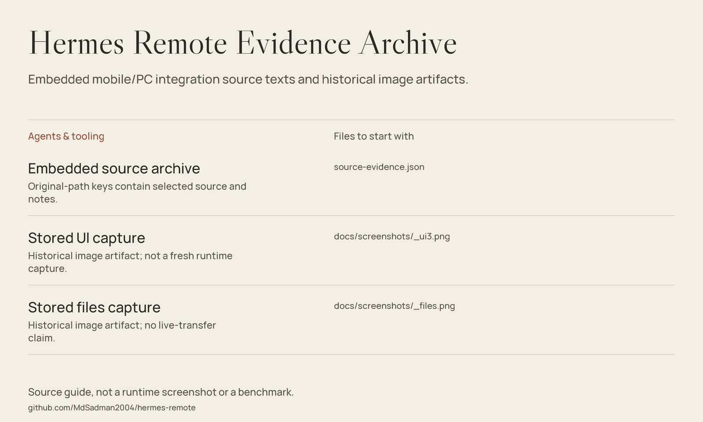

# Hermes Remote — Source Evidence Archive



*Source guide drawn from the files in this repository; not a runtime screenshot or a fresh benchmark.*

**An archive of selected Hermes mobile/PC integration source text and historical captures.**
The implementation material is stored inside `source-evidence.json`, keyed by
original file path. It is not laid out as a runnable `pc/` directory or an
Android application checkout.

This distinction matters: copying launcher commands from the older README
cannot start a backend from the files actually present in this repository.

## What the archive contains

| Evidence area | Examples of embedded keys |
|---|---|
| PC dashboard launcher | `pc/hermes-dashboard.py`: health checks, dashboard startup, and pairing payload construction. |
| Pairing utilities | `pc/render_qr.py`, `pc/phone_sim.py`, and `pc/qr_server.py`. |
| Headless watchdog | `pc/hermes-watchdog-headless.py`: loopback probe and recovery-script invocation. |
| Android client fragments | Connection management, REST/WebSocket transport, credential storage, and UI components. |
| Build configuration fragments | Root/app Gradle scripts, settings, and Android manifest text. |
| Historical findings | `PHASE0-FINDINGS.md` and `PROJECT-INDEX.md`. |

These are **embedded text entries**, not separately available paths in this
checkout. Some referenced support files and the external backend are absent.

## Getting started: inspect, do not launch

A Python 3 interpreter is sufficient to inspect the archive; no third-party
package installation is required for these commands.

```bash
git clone https://github.com/MdSadman2004/hermes-remote.git
cd hermes-remote
python -c "import json; d=json.load(open('source-evidence.json', encoding='utf-8')); print('\n'.join(sorted(d)))"
```

Read a specific embedded file without executing it:

```bash
python -c "import json; d=json.load(open('source-evidence.json', encoding='utf-8')); print(d['pc/hermes-watchdog-headless.py'])"
```

For protocol context, inspect the archived findings:

```bash
python -c "import json; d=json.load(open('source-evidence.json', encoding='utf-8')); print(d['PHASE0-FINDINGS.md'])"
```

The findings distinguish earlier loopback probes from unresolved off-box
networking/authentication work. Treat their dates, success statements, and
machine paths as historical notes, not the state of your own installation.

## Before attempting a reconstruction

- Obtain a complete, compatible Hermes backend and Android client checkout.
- Restore the missing project files, build wrapper, resources, and script dependencies.
- Replace installation-specific paths and validate backend API compatibility.
- Review authentication, TLS/network exposure, firewall policy, and secret handling.
- Determine which historical launcher and authentication approach applies;
  the archived files describe more than one stage of the integration.

The embedded dashboard launcher invokes an external Python environment and
uses port `9119`, not the older README's claimed standalone server on `8080`.
The QR renderer imports `qrcode`; the launcher and watchdog depend on files
outside this archive. Those observations are not a complete installation recipe.

## Source guide

| Repository path | What can be inspected |
|---|---|
| [Source evidence](source-evidence.json) | Embedded file texts and their original path keys. |
| [Stored UI capture](docs/screenshots/_ui3.png) | Historical image artifact; not a fresh runtime verification. |
| [Stored files capture](docs/screenshots/_files.png) | Historical image artifact; not evidence of a working transfer today. |
| [Stored operations capture](docs/screenshots/_ops3.png) | Additional archived image. |

The source-guide diagram points to these actual repository artifacts,
not to nonexistent standalone `pc/` or `app/` directories.

## Scope & limitations

- This is an evidence archive, not a standalone build or supported deployment bundle.
- No backend, Android build, phone pairing, or remote transfer was run for this refresh.
- Archived launcher text can bind all network interfaces and print login or QR
  credentials. Do not execute it unchanged or expose that output publicly.
- The watchdog refers to `hermes-watchdog.ps1`, which is not an embedded entry;
  other historical notes also reference files outside the archive.
- Embedded Kotlin/Gradle fragments do not establish a complete, reproducible APK build.
- Existing captures were not recreated or used as the overview diagram.

## License and provenance

Original README notice: `MIT © Md Sadman Bin Masud`. The embedded `LICENSE`
also identifies `Copyright (c) 2026 Md Sadman Bin Masud`.
No standalone license file exists in this repository. The evidence JSON
contains a historical `LICENSE` text entry, but this README does not extend
that entry into a blanket grant for the archive or screenshots.
Embedded historical notes retain their original attribution, including the
`PROJECT-INDEX.md` attribution to Claude (Cowork).
